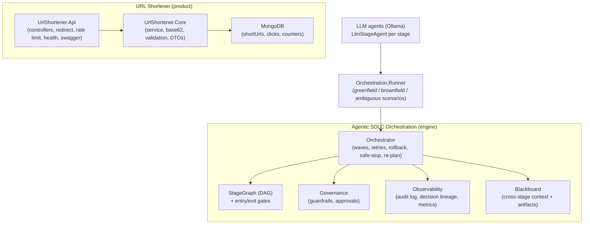
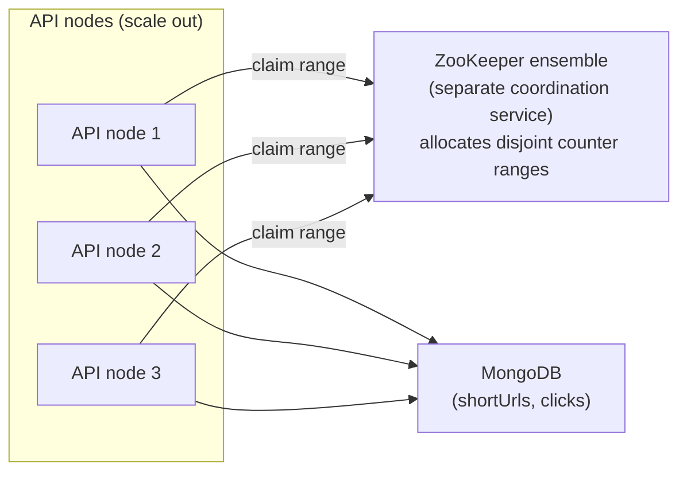
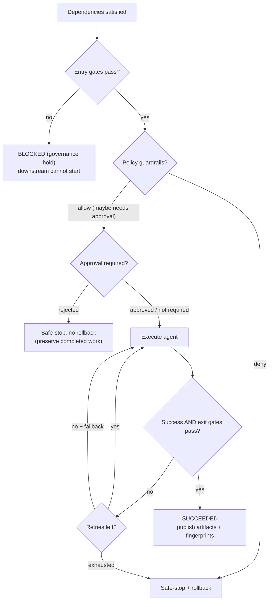
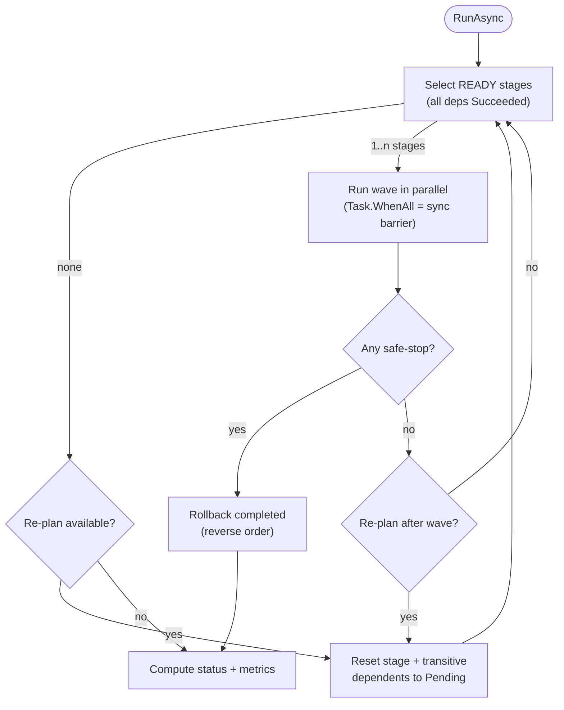

# Architecture Overview

This document describes the components, the orchestration model, the control flow, and the key
engineering decisions. It maps directly to the assignment's core requirements.

---

## 1. Components

The two halves are intentionally decoupled: the engine is a general SDLC orchestrator, and the
scenarios instantiate it to build/enhance the URL shortener. Every stage is a real local LLM
agent (`LlmStageAgent` backed by Ollama); the governance around the agents is identical regardless
of what the agent is.

> **Short-code generation (Zookeeper-style).** Short codes are the Base62 encoding of a monotonic
> counter served from reserved counter *ranges* (`ICounterRangeProvider` + `IRangeAllocator`). In a
> distributed deployment the range allocator would be backed by **Apache ZooKeeper** (or an
> equivalent coordination service) so many API nodes can each claim a disjoint range without
> colliding. This prototype models the same pattern locally with a **MongoDB atomic counter**
> (`findOneAndUpdate` with `$inc`), shown as the `counters` collection above, so no ZooKeeper process
> is required to run it. ZooKeeper is therefore a design/production choice behind the allocator
> interface, not a runtime dependency of the local build.

In production, **ZooKeeper is a separate system**: it runs as its own clustered service (an ensemble
of typically 3 or 5 nodes for quorum), and the API talks to it over the network purely to allocate
counter ranges. It is not embedded in the API process. The `IRangeAllocator` seam is what lets the
local build swap that separate service for a single MongoDB counter document without any change to
the shortening service.

Each node claims a range from ZooKeeper once, then hands out codes from it locally (no per-code
network call), and only returns to ZooKeeper when its range is exhausted. Locally, that "claim a
range" call is the MongoDB `$inc` instead.

**In this build (runtime specifics):**

- The active allocator is `MongoRangeAllocator`. The counter is a single persisted document in the
  `counters` collection (`_id = "shortcode"`, field `Seq`); the source of truth lives in MongoDB.
- Reserving a range is one atomic `FindOneAndUpdate` with `$inc` per range (default size 1000), so
  MongoDB is touched roughly once per 1000 codes, not once per code.
- `RangeCounterProvider` holds the current range window `[current, rangeEnd)` **in memory** per
  process and serves each code with `current++`; it calls the allocator only when the window is
  exhausted. On restart the unused tail of a range is skipped (codes stay unique).
- The counter is seeded once to `62^6` (`SevenCharOffset`) so codes are 7 Base62 characters.
- The `IRangeAllocator` seam has other implementations behind the same one method:
  `InMemoryRangeAllocator` (used by tests) and `FileRangeAllocator` (file-backed); a production build
  would add a ZooKeeper-backed one. Only the wiring changes, not the shortening service.

---

## 2. Orchestration model (the differentiator)

The engine is a **governed, stateful, non-linear** executor over an explicit dependency graph, not a
linear task chain. Each requirement from the brief maps to a concrete mechanism:

| Requirement | Mechanism | Where |
| --- | --- | --- |
| Explicit dependency graph with entry/exit gates | `StageGraph` (validated DAG) + `IGate` on each node | [Graph](../src/UrlShortener.Orchestration/Graph), [Gates](../src/UrlShortener.Orchestration/Gates) |
| Sequential + parallel paths with synchronization | Ready stages run in parallel **waves** with a barrier between waves | `Orchestrator.RunAsync` |
| Cross-stage context + decision lineage | `Blackboard` (artifacts + facts); `AuditLog.RecordDecision` | [Execution](../src/UrlShortener.Orchestration/Execution), [Observability](../src/UrlShortener.Orchestration/Observability) |
| Human approval checkpoints for high-impact actions | `IApprovalHandler` + `RequireApproval` on a node | [Governance](../src/UrlShortener.Orchestration/Governance) |
| Bounded retries, fallback, rollback, safe-stop | `RetryPolicy`, `Fallback` agent, `IRollbackAction`, `StopKind` | `Orchestrator` |
| Policy guardrails (security/compliance/change control) | `IPolicyGuardrail` (allow / deny / escalate-to-approval) | Governance |
| Audit-grade observability + traceability | Append-only `AuditLog` with correlation id + categories | Observability |
| Reliability metrics | `ReliabilityMetrics`: success rate, retry/rollback frequency, MTTR, latency | Observability |
| Dynamic re-planning on upstream change | `IReplanPolicy` invalidates a stage + its transitive dependents | [Replanning](../src/UrlShortener.Orchestration/Replanning) |
| Controlled autonomy | Agents run only after gates + guardrails + approvals pass | `Orchestrator` |

### Stage lifecycle (control flow for one stage)

### Pipeline scheduling (waves, synchronization, re-plan)

---

## 3. Governance and safety controls

- **Entry gate** (hold): a failed entry gate is a *governance hold*, not a crash. The stage is
  `Blocked`, downstream stays `Pending`, and the pipeline ends `PartiallyCompleted` unless a re-plan
  unblocks it. This is how the ambiguous scenario pauses for human clarification.
- **Policy guardrail** (deny): a security/compliance violation triggers a **safe-stop with rollback**
  of completed stages in reverse order (compensating actions).
- **Approval rejection**: a rejected high-impact action is a **safe-stop without rollback**. Nothing
  ran, so completed work is preserved for a later re-attempt.
- **Bounded retry + fallback**: transient failures are retried with exponential backoff up to a cap;
  an optional fallback agent is tried before declaring terminal failure.
- **Re-plan bound**: `OrchestratorOptions.MaxReplans` caps dynamic re-planning so a flapping upstream
  cannot loop forever.

Every one of these produces an audit entry and (for governance choices) a decision-lineage record
with a rationale, so any run is fully reconstructable.

---

## 4. Reliability metrics

`ReliabilityMetrics` is updated with thread-safe increments during parallel waves and reports:

- **Success rate** = succeeded / attempted stage executions.
- **Retry frequency** and **rollback frequency** (per attempted execution).
- **MTTR** = mean time from a stage's first failure to its eventual recovery (retry/fallback success).
- **End-to-end latency** and per-stage latencies.
- Re-plan count, approvals requested/rejected, guardrail denials.

---

## 5. Key decisions and rationale

1. **DAG + gates over a linear pipeline.** The brief explicitly asks for non-linear, stateful
   execution with governance. A validated dependency graph with per-node entry/exit gates makes the
   control flow explicit and testable, and enables parallel branches with a synchronization barrier.
2. **Blackboard for cross-stage state.** A shared artifact/fact store makes execution stateful and
   lets gates reason over prior outputs. Artifact **fingerprints** give a concrete, hashable basis for
   detecting upstream change and re-planning.
3. **Guardrails vs approvals are separate concerns.** Guardrails are automated policy (security,
   compliance, change control) and can hard-deny; approvals are the human boundary for high-impact
   actions. Keeping them distinct models real change-control cleanly (a guardrail can also *escalate*
   to an approval).
4. **Compensating rollback, not DB transactions.** SDLC steps span systems (repos, CI, docs), so
   rollback is modeled as per-stage compensating actions executed in reverse completion order.
5. **Typed `Result<T>` in the product, not exceptions for control flow.** The shortening service
   returns typed error codes that the API maps to precise HTTP statuses, keeping the domain host-agnostic.
6. **Security by default in the product.** http(s)-only destinations, private/loopback host blocking
   (SSRF), salted-hash IP storage for analytics, and rate limiting on link creation are on by default
   rather than opt-in. (Short codes default to the collision-free counter generator; a random
   generator is available where non-guessable codes are required, see decision 8.)
7. **`net8.0` (LTS).** Chosen for broad package compatibility and long-term support; the repo also
   builds on the newer SDK present on the machine.
8. **ZooKeeper-style counter ranges for collision-free codes.** Codes are Base62 of a monotonic
   counter drawn from reserved ranges behind `ICounterRangeProvider` / `IRangeAllocator`. Each node
   consumes its own range locally, so links are inserted **without a per-row collision check** and
   codes never clash across nodes. ZooKeeper is the natural production allocator (durable, distributed
   coordination); locally it is modeled by a MongoDB atomic counter, and the interface keeps either
   backend swappable. Trade-off: counter codes are sequential (enumerable); a random Base62 generator
   is included for cases that need unpredictable codes.

---

## 6. The agent seam (real LLM agents)

`IStageAgent.ExecuteAsync(StageContext) -> StageOutcome` is the single seam. Most stages are real LLM
agents: `LlmStageAgent` builds a prompt from its role plus the upstream artifacts on the blackboard,
calls a local model through Ollama (`OllamaClient`), and stores the model's output as that stage's
`Artifact`. Non-LLM agents plug into the same seam: the greenfield `implementation` stage uses a
deterministic `ScaffoldAgent` that emits a validated, runnable project scaffold
(`SCAFFOLD_UrlShortener.md`), and the brownfield `implementation` stage wraps its LLM agent with a
`TransientFaultAgent` to demonstrate bounded-retry recovery. The orchestration, governance,
observability, and metrics around the agent remain unchanged whether it is an LLM, a tool, or a
script, which is the point: **autonomy is bounded by the surrounding governance, not by the agent
itself.** A production system would add agents that call actual code generators, test runners, and
doc builders behind the same interface without touching the engine.
