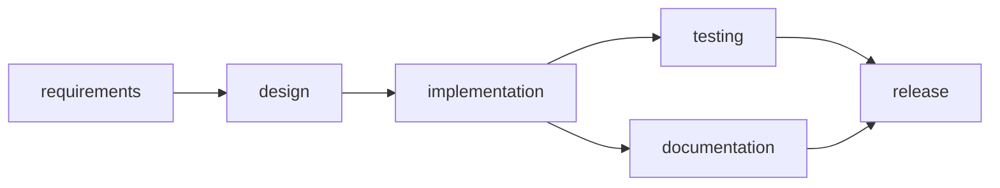
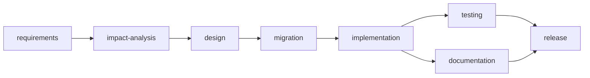
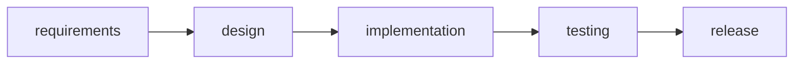

# Scenarios

Three scenarios exercise the orchestration engine end to end. Run them with:

```powershell
dotnet run --project src/UrlShortener.Orchestration.Runner -- all
```

Each run prints an audit trail (with correlation id), decision lineage, per-stage outcomes,
reliability metrics, and the final artifact set. The observed results below come from an actual run.

---

## 1. Greenfield: build the shortener from scratch

**Requirement:** Build a working URL shortener with core APIs, analytics, and reliability features.

### Decomposition (dependency graph)



### Orchestration highlights
- `design` has an **entry gate** requiring the `requirements.md` artifact and a `requirements.clarified`
  fact, plus a **security guardrail** (threat model reviewed).
- `implementation` emits a validated, runnable project scaffold (`SCAFFOLD_UrlShortener.md`) via a
  deterministic agent, so the output is known-good rather than model-improvised. Pass `--out <dir>`
  to write it to a folder of your choice.
- `testing` and `documentation` run as a **parallel wave**, synchronized before `release`.
- `testing` has an **exit gate**: it must set `tests.green` before downstream may proceed.
- `release` is a **high-impact, human-approved** action (approved by the console approval handler).

### Validation and result
- Full pipeline **Succeeded**, success rate 100%, 0 retries, 0 rollbacks.
- Demonstrates: requirement understanding, decomposition, DAG with gates, parallel + synchronized
  execution, and a human approval checkpoint.

---

## 2. Brownfield: add click analytics to the existing shortener

**Requirement:** Enhance the existing shortener with per-redirect click analytics and a stats API,
privacy by design.

### Decomposition



### Orchestration highlights
- **Codebase reasoning**: the `impact-analysis` stage identifies impacted modules/APIs/data flows
  (redirect path, `ResolveAndRecordAsync`, new `ClickEvent` document, MongoDB collection, stats
  endpoint) before any code is written.
- **Bounded retry**: `implementation` fails its first attempt with an injected transient
  "MongoDB write timeout", then **recovers on retry** (the real LLM agent produces the code on the
  second attempt). This is reflected in the retry count and MTTR.
- **Change control**: the `migration` stage's guardrail **escalates to human approval** (DBA sign-off
  for a schema change).
- **Dynamic re-plan**: after `testing` passes, a performance review determines the synchronous
  analytics write is on the redirect hot path and exceeds the latency budget. The engine **re-plans**,
  invalidating `implementation` and its transitive dependents, and re-runs them (write buffered
  asynchronously).

### Validation and result
- Pipeline **Succeeded** with 1 retry and 1 re-plan; both approvals granted.
- Demonstrates: brownfield codebase reasoning, retry/MTTR, change-control approval, and dynamic
  re-planning when upstream outputs change.

---

## 3. Ambiguous: "make the links smarter"

**Requirement:** Make the links smarter. (Intentionally under-specified.)

### Decomposition



### Orchestration highlights
- **Ambiguity detection**: `requirements` recognizes "smarter" is undefined, emits open questions, and
  sets `requirements.clarified = false`.
- **Governance hold**: `design`'s entry gate requires `requirements.clarified`, so the pipeline
  **blocks** rather than guessing.
- **Human clarification via re-plan**: a product-owner clarification arrives (device-aware redirect +
  auto-expiry after N clicks). The engine **re-plans**, re-runs `requirements` to produce a concrete
  spec, and the `design` gate then passes.
- **Risk control**: at `release`, a **security guardrail denies** the cut. Multi-destination "smart"
  redirects introduce an open-redirect / phishing vector and destination allow-listing is not yet
  implemented. The engine performs a **safe-stop with rollback** of the completed stages in reverse
  order.

### Validation and result
- Pipeline **SafeStopped**: 1 re-plan, 1 guardrail denial, 3 rollbacks. Completed work is compensated
  and the run halts before shipping a security risk.
- Demonstrates: handling ambiguous requirements, clarification-driven re-planning, automated risk
  control, and controlled autonomy (the system refuses to release an unsafe change without resolution).

---

## What the three scenarios prove together

| Capability | Greenfield | Brownfield | Ambiguous |
| --- | :---: | :---: | :---: |
| Requirement understanding | yes | yes | yes (ambiguity detected) |
| Task decomposition (DAG) | yes | yes | yes |
| Codebase reasoning | | yes | |
| Entry/exit gates | yes | yes | yes (hold) |
| Parallel + synchronization | yes | yes | |
| Human approval | yes | yes | (blocked earlier) |
| Bounded retry + MTTR | | yes | |
| Change-control guardrail | | yes | |
| Security guardrail + rollback | | | yes |
| Dynamic re-planning | | yes | yes |
| Safe-stop | | | yes |
